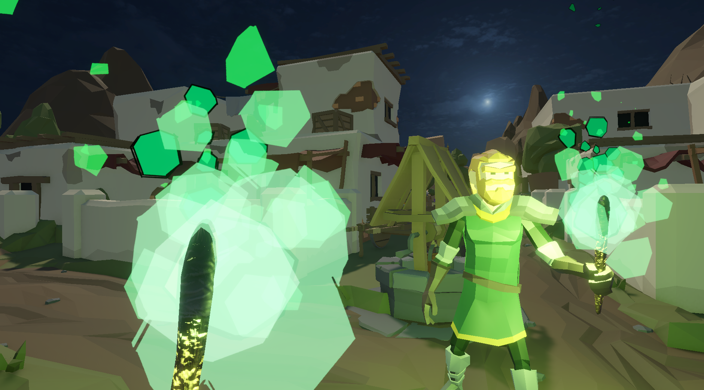
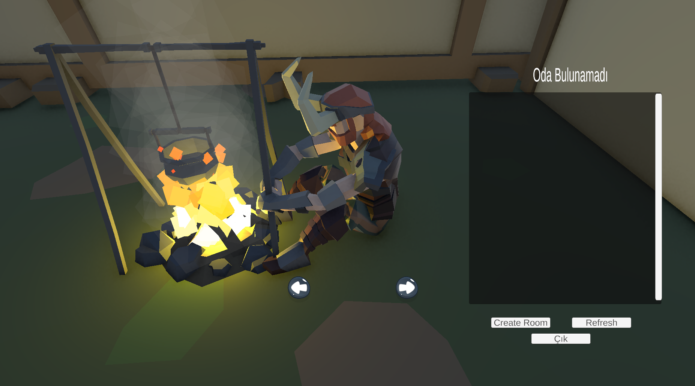
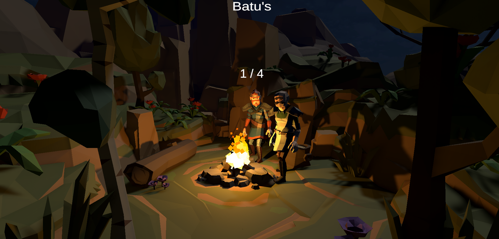

# Photon Fusion Multiplayer Game

Bu proje **Photon Fusion 2** kullanılarak geliştirilmiş bir multiplayer oyun prototipidir.  
Projede amaç, oyuncuların aynı sahnede network üzerinden etkileşimde bulunmasını sağlamaktır.  

---

## 🎮 Özellikler

- Photon Fusion 2 ile çoklu oyuncu desteği
- **Shared Topology** ile tüm oyuncular aynı network yapısında senkronize
- **RPC (Remote Procedure Call)** kullanımı ile oyuncular arasında veri ve komut senkronizasyonu
- Uygun sahne yapılandırması yapıldı, networked property’ler ve RPC’ler üzerinden oyun akışı yönetiliyor
- Networked property kullanımı ile oyuncu durumları senkronize ediliyor
- Photon Voice 2 entegrasyonu ile ses desteği

---

## 📦 İçerik
- Derlenmiş sürümler ve zip dosyaları için: Releases  kısmında indirebilirsiniz
---
## ODAYI KURUP BEKLEME ODDASINA GEÇTİKTEN SONRA 'L' TUŞUNA BASIP OYUNU BAŞLATABİLİRSİNİZ.
## 🖼️ Oyun İçi Görseller

  
  
  

---

